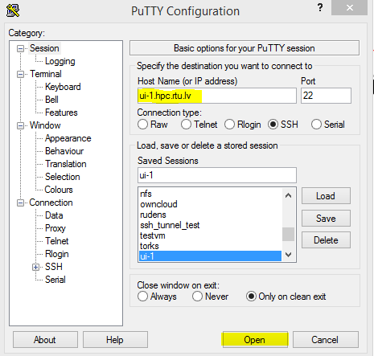
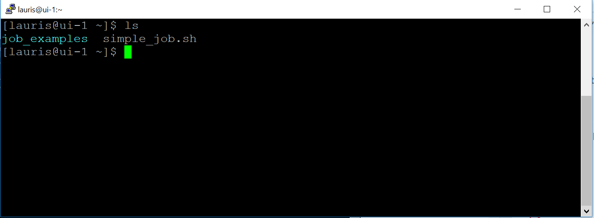
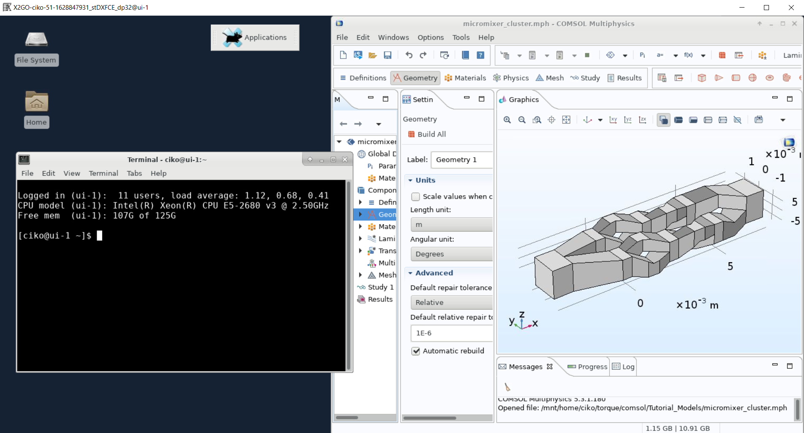
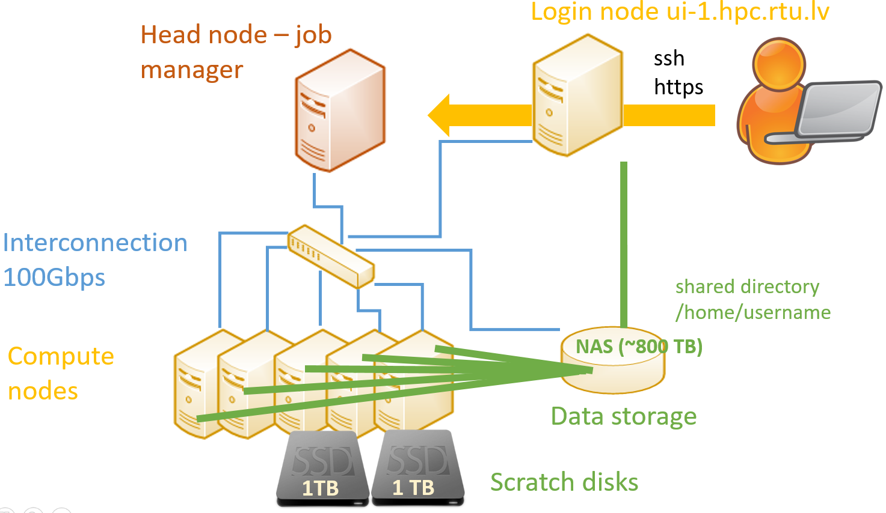
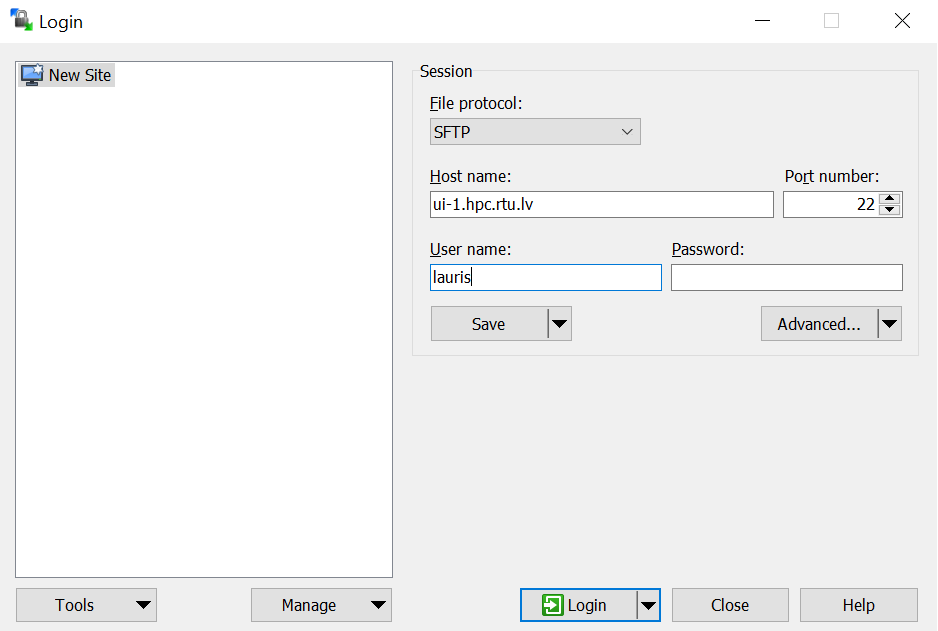
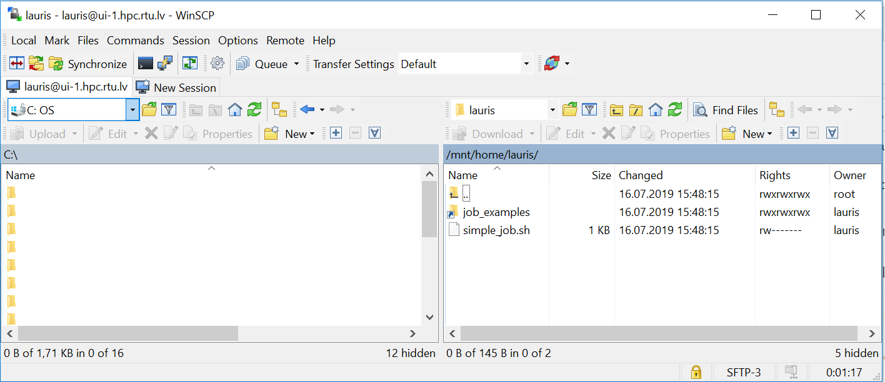

# Getting started with the cluster

## Accessing the cluster

Work with the cluster occurs via a dedicated server (login node) with Centos7 Linux operating system and job management tools installed. After connection, the user is able to use the command line with Unix commands, and it is possible to edit and compile a code, submit a job (simulation) and monitor its execution on computing resources. From the command line the user can also call graphical tools/windows described below in the document.  
**We ask users not to use the login nodes for the resource-consuming operations. The login nodes are meant only for copying files to or from the cluster, preparing jobs, submitting jobs to a queue and monitoring results. Testing a short (<5 min.) job or compiling a code on a few CPU cores is acceptable.**.  
Also note that running code or simulation on the login node (also opening a software GUI) does not automatically ensure that the job will run on computing nodes. This requires you to use the job management tools described in section Job Management.  

Command-line access parameters:
- Primary login node: ui-2.hpc.rtu.lv 
- Backup login node: ui-1.hpc.rtu.lv 
- Protocol: Secure Shell (SSH) 
- Port:22 
- For authentication use the login name and password you received when registered for the cluster access. 
- Access is ensured from any IP address.

### Tools for accessing command line
SSH connection can be done with the following tools:
- If you use a Linux or MacOS operating system, you can connect to a cluster with SSH by opening the command line (terminal) and running the following command:
   ```
   ssh <username>@ui-1.hpc.rtu.lv
   ```
- For Windows operating system, you can use PuTTY (download it from: http://www.putty.org/). The parameters you should enter are given above in the Command line access parameters section. The example is shown in the figure below.  
   

   After you open the connection, a login name and password are required. After entering them, it is possible to use a remote terminal with Unix commands.  
   

### Graphical interface through command line
When using cluster through an SSH client (like PuTTY), not only the command line terminal but also graphical tools may be used. SSH ensures X11 forwarding from the cluster to user’s computer.  
Use the `-X` parameter when you connect to a cluster in a Linux environment.
```
ssh -X <username>@ui-1.hpc.rtu.lv
```
To use this function in MS Windows, additional preparation steps must be taken on the user’s personal computer..
1. Install X Windows server which can be download from: [https://sourceforge.net/projects/vcxsrv/](https://sourceforge.net/projects/vcxsrv/).
2. Run it in the background as a service. The first time you start, you may be prompted to change the settings, leave the default ones.
3. In addition, you’ll need to enable X11 forwarding in a PuTTY configuration (Connection --> SSH --> X11).

An example: Opening MATLAB GUI from the command line. To start the Matlab graphical interface on the cluster login node (ui-1.hpc.rtu.lv), connect to the cluster command line by using the graphical session forwarding described above.  
On the login node execute:
```
module load matlab/R2018a
```
```
matlab &
```
A program window will be opened on your computer, but all operations will run remotely on the cluster. The MATLAB interface provides the necessary tools for queuing and executing a task on computing nodes.


### X2Go remote desktop
Instructions will be added.



The client (your desktop) computer needs the [X2GO-client. ](https://wiki.x2go.org/doku.php/doc:installation:start)
Setup on Windows and Linux is simple, just download and install the program. Many Linux distributions have an X2Go package in their package manager (apt, yum, etc.) so check that before downloading it from the website. If there is a package, it’ll be called **x2goclient**.
- #### Configuring the client:
During first use X2GO-client needed to be configured as it is shown at the picture. To configure, select in the upper left corner "Session" tab.
The setting of the ssh-key is only necessary, if you use a non-standard name or not the default key.


## User workspace
Each user has prepared workspace, where to store files related to the jobs. By logging into the system using command-line, the user is automatically directed to the work directory: `/home/username` or `/home_beegfs/username`.  
Directory is shared between all cluster nodes using networked file system (NFS or BeeGFS), therefore no need to copy files from login node to compute node where job is executed as well as between the computing nodes for parallel jobs.  
   

The users can install/compile software in their workspace if the installation process does not require administrator (root) permissions.  
### Copy files to the cluster
To copy files from your computer to the cluster login node, MS Windows users can use tools as WinScp or FAR file manager. WinScp can be downloaded here: [https://winscp.net/eng/download.php](https://winscp.net/eng/download.php). Connection is similar to that of PuTTY:  


On the left, you’ll see your computer files, and the right – work directory on the cluster. You can drag and drop files with a computer mouse from one window to another:  


On a MacOS or Linux operating system, use a command-line SCP command or any convenient graphical tool. An example of copying a file from a Linux command line:
```
scp –r my.file username@ui-1.hpc.rtu.lv:
```

---

## Using software modules
Users can use modules ([Environment Modules](http://modules.sourceforge.net/)) to prepare their environment for running different software, compilers, and libraries available on the cluster. Modules provide an opportunity to access preinstalled software in the cluster instead of installing/compiling everything yourself, and also convenient use of different versions of the same software. To get a list of all possible modules (software and tools pre-installed on the cluster), execute command:  
```
module avail
```

A software module is loaded with the command `module load <module_name>`. For example: 
```
module load gnu8/8.3.0
```
It sets the path (PATH) to executable files, libraries (LD_LIBRARY_PATH), and other required environment variables for a particular software. 
Loading modules for the tools (packages) included in Linux distributive usually is not required.  
The module must be loaded on the node where software is started. If a job is executed on a computing node/s, the module must be loaded on it as well or should be passed from a login node with job management commands.  
Get the list of allready loaded modules:
```
module list
```
To unload a module:
```
module unload gnu8/8.3.0
```
More about using modules: [http://modules.sourceforge.net/](http://modules.sourceforge.net/).

### Private Modules
If a user compiles the software in his/her work directory, it is also possible to create their own modules. Briefly:
1. Create a directory `/home/<username>/privatemodules`
2. Create your own module into this directory. Samples are in `/opt/exp_soft/modulefiles` directory
3. Activate your private module directory when starting the work by executing:
   ```
   module load use.own
   ```
   You can put this command in ~/.bashrc file.  
4. Then load your own module
   ```
   module load <module_name>
   ```

