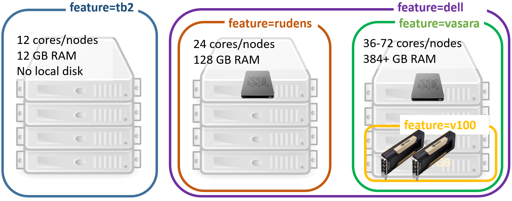

# Using ansysHFFS on the cluster

## Connecting to the desktop environment
To launch ansys hfss you need to use x2go or a similar x11 forwarding program. Connect to the login node using the XFCE desktop environment setting in x2go.

[ff](images/ansys_simulate_select.PNG)

The job management system used in RTU cluster is Torque/Moab. Torque is a basic batch system, and Moab provides higher-level job scheduling and cluster management functionality.

---

## Queuing/Running a Job
Before a job gets to a computing node and starts to execute, it is placed in a virtual queue. The queue organises resource allocation in a multi-user system where the number of jobs and their requirements may exceed the number of available resources (CPU, memory). When resources become available, usually the job waiting in the queue longer will be executed next. Users do not have to monitor the resource availability, job movement in the queue and execution is automatic. If there is no waiting jobs in a queue (meaning that the resources are available), then the job is started immediately.
### Simple Job
Jobs are queued using special Torque/Moab cluster user’s tools ([detailed documentation available online](https://support.adaptivecomputing.com/wp-content/uploads/2021/02/torque/torque.htm#topics/torque/2-jobs/submittingManagingJobs.htm)).
Command for submitting a simple job (batch script):
```
qsub test.sh
```
`test.sh` is a bash script with commands to execute when the job gets to a computing node. It ensures execution of a batch job without user’s participation. Examples of the batch scripts for launching various software applications on the cluster “Rudens” and other useful information can be found in the directory:  `/opt/exp_soft/user_info`.

### Interactive Job
Alternatively, an interactive job can be used instead of batch. The interactive mode is convenient for testing and debugging jobs or in case graphical tools are used. Start an interactive job:
```
qsub -I
```
Automatically a remote terminal on a computing node will be opened where a user can execute the needed commands by writing them in the command line. The command is similar to `ssh <hostname>`, with the difference that resources are reserved and there will not be any conflicts with other users.

If it is necessary to open a graphical window in an interactive regime, add `-X` parameter.
```
qsub -X -I
```

### Job requirements
Users can indicate the job parameters and requirements, like the name of the queue to be used or the time necessary for the job. This information will be used to find the most suitable resources for the job.
```
qsub –N my_job –q fast –l walltime=00:00:30 test.sh
```
You can add requirements at the beginning of the job script:
```
#!/bin/bash
#PBS -N my_job             # Job name
#PBS -l walltime=00:00:30  # Expected job maximum duration
#PBS -l nodes=1:ppn=1      # Computing resources needed
#PBS -q fast               # Queue
#PBS -j oe                 # Combine standard output and error in the same file
```
The requirements can be entered in either the command line or the script, but highest priority is given to the requirements in the command line in case they repeat.

How to request specific computing resources?  Define the requirements with qsub -l and indicate these parameters:
- number of cores: `-l procs=12`
- number of nodes and cores (use this notation for MPI jobs): `-l nodes=2:ppn=12`
- particular node (may result in more queue time):`-l nodes=wn62:ppn=64` or `-l nodes=wn02:ppn=18+wn03:ppn=18`
- use nodes only from the list: `-W x=HOSTLIST:wn02,wn03,wn04,wn05,wn06,wn07,wn08,wn09,wn10,wn11`
- number of GPUs: `-l nodes=1:ppn=12:gpus=2`
- necessary amount of memory (per CPU core): `-l nodes=1:ppn=12,pmem=1g`
- necessary amount of memory (for a job): `-l nodes=1:ppn=12,mem=12g`
- Require computing nodes with particular features. The features are usually used on clusters with non-homogeneous nodes. For example, to guarantee the job exaction on the latest generation nodes (with 36 CPU cores per node): `-l feature=vasara`

  {scale=80 align=center}

For full list of node names and features, please refer to the section HPC hardware specifications.

### Parallel (MPI) job
A job is divided between several cores in a node or between cluster nodes using Message Passing Interface (MPI) protocol. Queuing a parallel job requiring 24 cores (2 nodes × 12 cores in each node):
```
qsub -l nodes=2:ppn=12 run_mpi.sh
```
We advise to use OpenMPI versions which are pre-compiled for the cluster with Torque support.
```
module load mpi/openmpi-<version>
```
An example of `run_mpi.sh` script:
```
#!/bin/bash
#PBS -N my_mpi_job
#PBS -l walltime=00:00:30
#PBS -q batch
#PBS -j oe

#change directory to working directory
cd mpi_tests 	

#load OpenMPI module
module load mpi/openmpi/openmpi-default

#compile code with MPI C++ compiler
mpic++ MPItest.c -o MPItest.o

#execute program in parllel
mpirun -np 24 ./MPItest.o
```
MPI job examples can be found in the cluster directory: `/opt/exp_soft/users_info/mpi`
